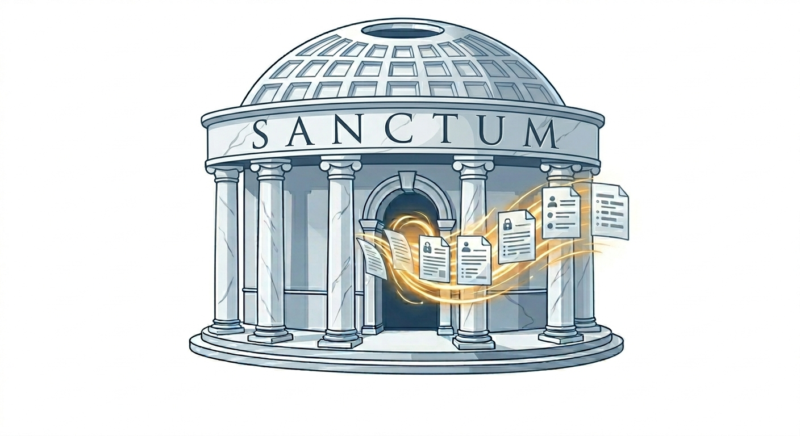

<div align="center">

<br/>


# Sanctum



### *Local-First Document Anonymization for Professionals*

**Remove PII from your documents — entirely on your machine, no cloud required.**

Sanctum is a local-first, air-gapped document anonymization desktop application built on [Microsoft Presidio](https://microsoft.github.io/presidio/). It is designed for lawyers, consultants, and professionals who need to sanitize documents containing client confidential information before sharing, storing, or archiving them — without violating attorney-client privilege or international data protection laws (GDPR, HIPAA, DPDP Act 2023).

[Getting Started](#-getting-started) · [Features](#-features) · [Architecture](#-architecture) · [Roadmap](#-roadmap) · [Contributing](#-contributing)

---

</div>

## 📌 The Problem

Lawyers, consultants, and professionals routinely work with documents that contain sensitive client information — names, addresses, case numbers, financial details, national IDs. Sharing, archiving, or collaborating on these documents carries real legal risk if that information is not properly removed first.

The current tool landscape leaves individual practitioners with no practical options:

| Option | Problem |
|---|---|
| Enterprise e-Discovery (Relativity) | Designed for mass litigation teams, not individual practitioners |
| Cloud Redaction APIs (Azure, Nutrient) | Data leaves the machine; unacceptable for confidential material |
| Open-Source Frameworks (Presidio) | Requires Python expertise and CLI knowledge |
| Manual Find-and-Replace | Error-prone, slow, and leaves quasi-identifiers intact |

**Sanctum fills this gap.** A standalone, installable desktop app that detects and removes PII from documents — entirely locally, with a human-review step before any change is made permanent.

---

## ✨ Features

### 🛡️ Core Anonymization Engine
- **Powered by Microsoft Presidio** — dual-engine architecture separating PII *detection* from *transformation*
- **Named Entity Recognition (NER)** via spaCy and Transformer backends for unstructured text (names, locations, organizations)
- **Pattern Recognition** via customizable regex + contextual proximity scoring for domain-specific identifiers (case numbers, account numbers, national IDs)
- **Luhn Checksum Validation** to eliminate false positives in financial data strings
- **Multiple Anonymization Operators**: redaction, pseudonymization, encryption (AES-256), and synthetic HIPS replacement

### 🖥️ Desktop-First UX
- **Downloadable native app** — install from the web or a store, launch like any other desktop application
- **Clean GUI with Human-in-the-Loop Review** — paste or import text, review detections, confirm before any irreversible change
- **Drag-and-drop document processing** — drop a `.docx`, `.pdf`, or `.xlsx` file directly into the app
- **No terminal, no Docker, no CLI** — everything runs behind a standard GUI

### 🔒 Sovereign, Air-Gapped Architecture
- **100% local processing** — Presidio engine, NLP models, and OCR all reside on your machine
- **Zero network calls** — no data ever transmitted to a cloud provider
- **Zero-Retention Mode** — no data stored after session ends
- **Encrypted Mapping Store** — pseudonym-to-original mappings protected by a user-defined master key

### 🧠 NLP-Plus Semantic Intelligence
- **Confidence Thresholding** — set your own risk tolerance (e.g., "flag anything above 30% confidence")
- **Entity-Specific Policies** — redact witness names but preserve defendant names; fully configurable per entity type
- **Decision Tracing** — every detection logged with its reasoning (`Pattern: Regex | Score: 0.85 | Context: "bank account"`)
- **Risk Scoring** — post-anonymization identifiability score so you know how much residual risk remains
- **HIPS Surrogate Replacement** — replace `John Smith` with `Alex Doe` to preserve document readability and structure

### 📂 Multi-Format Support
- `.docx` — Word documents with full formatting preservation
- `.xlsx` — Excel spreadsheets
- `.pdf` — with burn-in redaction (text structurally removed, not just visually obscured)

---

## 🏗️ Architecture

Sanctum runs entirely on the local machine. The GUI communicates with a bundled Python backend — no data ever leaves the device.

```
┌─────────────────────────────────────────────────────────────────┐
│                     Sanctum Desktop App                         │
│              (Downloadable — Windows / macOS)                   │
│  ┌─────────────────────────────────────────────────────────┐   │
│  │                   Sanctum GUI                           │   │
│  │   [ Import Document ]      [ Review Detections ]        │   │
│  │   [ Mapping Manager ]      [ Risk Score: 12% ]          │   │
│  │   [ Export Clean Document ]                             │   │
│  └────────────────────────┬────────────────────────────────┘   │
└───────────────────────────│─────────────────────────────────────┘
                            │ internal (no network)
┌───────────────────────────▼─────────────────────────────────────┐
│                  Sanctum Processing Engine                      │
│  ┌──────────────────────────────────────────────────────────┐   │
│  │  Document IN ──► [ Analyzer Engine ] ──► [ Anonymizer ]  │   │
│  │                        │                      │           │   │
│  │               NER Recognizers          Operators:         │   │
│  │               Pattern/Regex            - Redact           │   │
│  │               Checksum Valid.          - HIPS Surrogate   │   │
│  │               Context Scoring          - AES-256 Encrypt  │   │
│  │                                        - Hash             │   │
│  └──────────────────────────────────────────────────────────┘   │
│  ┌──────────────────────┐  ┌───────────────────────────────┐   │
│  │   spaCy / Transformers│  │  Encrypted Mapping Store      │   │
│  │   (Local NLP Models) │  │  (Pseudonym ↔ Original Keys)  │   │
│  └──────────────────────┘  └───────────────────────────────┘   │
└─────────────────────────────────────────────────────────────────┘
                            │
                  Clean document exported
                  to disk — what you do
                  with it is up to you
```

### Tiered Model Strategy

To accommodate different hardware, Sanctum offers two NLP tiers:

| Tier | Model | RAM Requirement | Best For |
|---|---|---|---|
| **Standard** | `spaCy en_core_web_sm` + Regex | ~512 MB | Standard laptops, fast processing |
| **Professional** | Transformer-based NER | ~2–4 GB | Workstations, high-accuracy requirements |

---

## 🔬 Privacy Methodology

Sanctum is designed around the legal and academic distinction between three privacy thresholds:

| Standard | Definition | Legal Status | Sanctum Support |
|---|---|---|---|
| **Anonymization** | Irreversible removal of all identifying information | No longer "personal data" under GDPR | ✅ Redaction + burn-in |
| **Pseudonymization** | Reversible replacement with coded identifiers | Still personal data under GDPR | ✅ Encrypted mapping store |
| **De-identification** | HIPAA-standard removal of 18 enumerated identifiers | Reduced regulatory burden | ✅ HIPAA mode (planned) |

Sanctum explicitly labels which threshold has been met for every document processed, so professionals are never in a position of mislabeling de-identified data as anonymous.

### Anonymization Operators

| Operator | Mechanism | Best For |
|---|---|---|
| **Redact** | Replaces with `[PERSON]`, `[ORG]` etc. | Maximum safety, court filings, archiving |
| **HIPS Surrogate** | Replaces with contextually plausible synthetic value | Sharing documents while preserving readability |
| **Pseudonymize** | Consistent code replacement with encrypted map | Reversible workflows where originals may be needed later |
| **Hash** | One-way SHA-256 | Datasets where consistency across records matters |
| **Encrypt** | AES-256 with key management | Reversible with key, shareable datasets |

---

## 🚀 Getting Started

> **Note:** Sanctum is currently in Phase 0 (foundation). The CLI is functional for text-based PII detection and anonymization. A packaged desktop app is planned for later phases.

### Prerequisites

- Python 3.10+
- Windows, macOS, or Linux

### Developer Install

```bash
# Clone the repository
git clone https://github.com/your-username/sanctum.git
cd sanctum

# Install in editable mode with dev dependencies
pip install -e ".[dev]"

# Download the spaCy NLP model
python -m spacy download en_core_web_sm
```

### CLI Usage

```bash
# Detect PII in text
sanctum analyze "Call John Smith at 555-0123 about case #2024-CV-1234"

# Anonymize with default operator (redact)
sanctum anonymize "John Smith, SSN 123-45-6789"

# Show current configuration
sanctum config
```

### Python API

```python
from sanctum.core.engine import SanctumEngine
from sanctum.analyzer.adapter import PresidioAnalyzer
from sanctum.anonymizer.adapter import PresidioAnonymizer

engine = SanctumEngine(
    analyzer=PresidioAnalyzer(),
    anonymizer=PresidioAnonymizer(),
)

text = "Please review the contract for John Smith at Acme Corp, reachable at john@acme.com."

# Detect PII
detections = engine.analyze(text)

# Detect and anonymize in one step
result = engine.process(text)
print(result.anonymized_text)
# "Please review the contract for <PERSON> at <ORGANIZATION>, reachable at <EMAIL_ADDRESS>."
```

---

## 📋 Compliance Reference

Sanctum is designed to help professionals meet the requirements of:

| Framework | Relevant Requirement | How Sanctum Helps |
|---|---|---|
| **GDPR (EU)** | Art. 4 — Pseudonymisation must be reversible; anonymisation must not be | Explicit threshold labeling |
| **HIPAA (US)** | Safe Harbor — removal of 18 enumerated identifiers | HIPAA entity recognizer (planned) |
| **Texas Bar Op. 705** | Lawyers must not knowingly reveal client confidential information | Air-gapped processing, zero retention |
| **California Bar AI Guidance** | Must anonymize client info before sharing or processing with any external service | Fully local anonymization before any document leaves the device |
| **DPDP Act 2023 (India)** | Personal data must be processed on India-hosted infrastructure | 100% local, no cloud calls |
| **EU AI Act (Aug 2026)** | High-risk AI systems must implement data governance measures | Audit trail + decision tracing |

---

## 🗺️ Roadmap

### Phase 0 — Foundation ✅ *(complete)*
- [x] Core Presidio integration (Analyzer + Anonymizer engines)
- [x] Hexagonal architecture: core domain layer with Protocol-based ports
- [x] spaCy NER backend with configurable model tiers
- [x] Redact, Hash, HIPS (Faker), and Pseudonymize operators
- [x] Configuration system (Pydantic Settings, env var support)
- [x] CLI interface (`sanctum analyze`, `sanctum anonymize`, `sanctum config`)
- [x] Plain text document adapter (reader + writer)
- [x] Test infrastructure: unit, integration, and evaluation harness
- [x] Evaluation corpus: 12 annotated synthetic fixtures across 6 domains

### Phase 1 — Document Processing & API
- [ ] Document format adapters (`.docx`, `.xlsx`, `.pdf` text extraction)
- [ ] Flask localhost API (background service for future GUI)
- [ ] Encrypted mapping store (AES-256, local SQLite) for reversible pseudonymization
- [ ] Custom legal-domain recognizers (case numbers, bar IDs, Bates numbers)
- [ ] Transformer-based NER (Professional tier)
- [ ] CI/CD pipeline + pre-commit hooks + linter enforcement

### Phase 2 — Intelligence & Compliance
- [ ] HIPAA entity recognizer mode (18 safe harbor identifiers)
- [ ] Risk scoring — post-anonymization residual identifiability metric
- [ ] Confidence thresholding with entity-specific policies
- [ ] Audit trail and decision trace export (JSON/PDF)
- [ ] Locale-specific recognizers (UK, EU, India)

### Phase 3 — Desktop GUI & Packaging
- [ ] Standalone desktop GUI (Electron or native wrapper around Python core)
- [ ] Drag-and-drop document import (`.docx`, `.pdf`, `.xlsx`)
- [ ] Selective redaction by entity type with human-in-the-loop review
- [ ] `.pdf` burn-in redaction (structural removal, not just visual)
- [ ] Packaged installers for Windows (`.exe`) and macOS (`.dmg`)

### Phase 4 — Store Release & GA
- [ ] `.xlsx` cell-level anonymization
- [ ] Tiered model selection in GUI (Standard / Professional)
- [ ] Multi-language support
- [ ] Differential privacy noise layer for structured exports
- [ ] Submission to Microsoft Store and/or Mac App Store

### Future Extensions *(post-GA)*
- [ ] **Microsoft Word Ribbon Add-in** — anonymize without leaving Word
- [ ] Track Changes integration for PII redlines within Word

---

## ⚖️ Ethical Constraints and Limitations

Sanctum is a tool to *reduce* risk, not eliminate it. Users must understand:

1. **No automated tool is 100% accurate.** Sanctum will miss some PII and may flag false positives. Every high-stakes document requires human review before the output is treated as final.

2. **Re-identification risk is never zero.** Paul Ohm's foundational research demonstrates that even well-anonymized datasets can be re-identified by linking to external data sources. Sanctum provides a risk score but cannot guarantee complete anonymity.

3. **Threshold labeling is your responsibility.** Sanctum tells you which privacy threshold it has met. It is the professional's responsibility to verify that threshold is sufficient for their jurisdiction and use case.

4. **This tool does not constitute legal advice.** Consult your bar association or data protection officer before relying on any anonymization tool for compliance purposes.

> Sanctum is designed to enforce a **Human-in-the-Loop** step for all irreversible operations. Automatic burn-in requires explicit confirmation.

---

## 🧰 Tech Stack

| Layer | Technology | Status |
|---|---|---|
| Anonymization Engine | [Microsoft Presidio](https://github.com/microsoft/presidio) | ✅ Integrated |
| NER Models | [spaCy](https://spacy.io/) (standard), HuggingFace Transformers (planned) | ✅ spaCy active |
| Synthetic Data (HIPS) | [Faker](https://faker.readthedocs.io/) | ✅ Integrated |
| Configuration | [Pydantic Settings](https://docs.pydantic.dev/latest/concepts/pydantic_settings/) | ✅ Integrated |
| CLI | [Click](https://click.palletsprojects.com/) + [Rich](https://rich.readthedocs.io/) | ✅ Integrated |
| Desktop GUI | Electron / native wrapper | Planned (Phase 3) |
| Background Service | Python + Flask (localhost) | Planned (Phase 1) |
| Encrypted Mapping Store | AES-256 (local SQLite) | Planned (Phase 1) |
| Document Processing | python-docx, openpyxl, pdfplumber | Planned (Phase 1) |
| Packaging | PyInstaller / Electron Builder | Planned (Phase 3) |

---

## 🤝 Contributing

Contributions are welcome, particularly in the following areas:

- **Locale-specific recognizers** (non-English NER, country-specific ID patterns)
- **Additional anonymization operators**
- **Desktop GUI design and UX**
- **Test coverage for edge-case PII patterns**

```bash
# Fork the repo, then:
git checkout -b feature/your-feature-name
# Make your changes
git commit -m "feat: describe your change"
git push origin feature/your-feature-name
# Open a Pull Request
```

Please read [CONTRIBUTING.md](CONTRIBUTING.md) before submitting.

---

## 📄 License

Sanctum is released under the [MIT License](LICENSE).

Microsoft Presidio is licensed under the MIT License. See [Presidio License](https://github.com/microsoft/presidio/blob/main/LICENSE).

---

## 🔗 References and Further Reading

- [Microsoft Presidio Documentation](https://microsoft.github.io/presidio/)
- [Paul Ohm — "Broken Promises of Privacy" (SSRN)](https://papers.ssrn.com/sol3/papers.cfm?abstract_id=1450006)
- [NIST IR 8053 — De-Identification of Personal Information](https://nvlpubs.nist.gov/nistpubs/ir/2015/nist.ir.8053.pdf)
- [Texas Bar Ethics Opinion 705](https://www.legalethicstexas.com/resources/opinions/opinion-705/)
- [California Bar — Generative AI Practical Guidance](https://www.calbar.ca.gov/Portals/0/documents/ethics/Generative-AI-Practical-Guidance.pdf)
- [GDPR — Article 4 Definitions](https://gdpr-info.eu/art-4-gdpr/)

---

<div align="center">

**Built for the professionals whose livelihoods depend on confidentiality.**

*Sanctum — Clean documents. Protected clients.*

</div>
